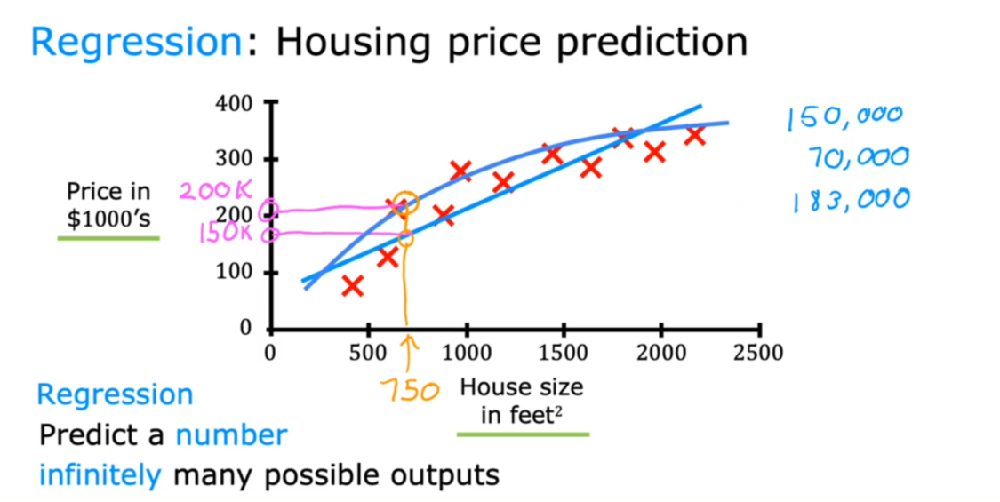
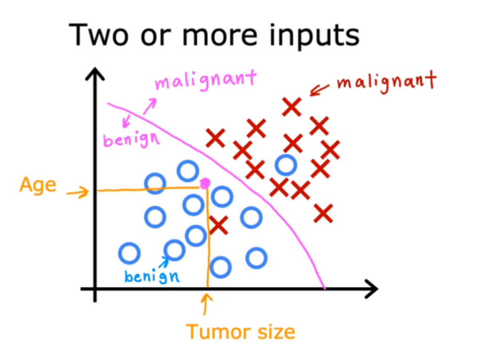
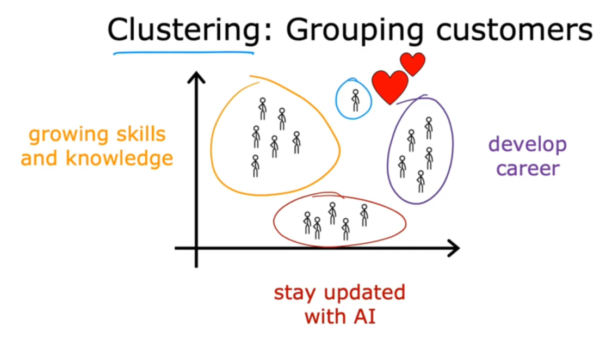

# 第一周笔记
## 1.1 引言
- 机器学习在日常生活中得到了广泛的应用  
- 机器学习也逐渐在工业领域开始发挥作用

## 1.2 机器学习的应用
- 传统方式：遇到问题-->分析问题-->编写算法-->解决问题

- 机器学习：遇到问题-->搜集或创造足够多的解决样例-->交给机器学习-->机器得出解决问题的方案-->机器解决问题

## 2.1 机器学习是什么
- 塞缪尔的定义：“给予电脑不需要明确编程的自学习能力的研究领域”

- 机器学习的主要分类：
  - 监督学习（使用最多，而且进步速度最快）
  - 无监督学习
  - 强化学习
  
## 2.2 监督学习part1
监督学习中最为常见的是预测类别的学习，也就是回归问题

输入x经过输出函数f的运算得到输出y

$$x \stackrel{f}{\longrightarrow} y$$

这个f可以是任何形式的函数，而函数形式越复杂，参数越多，就可以更为准确的拟合这些数据。
通过已知的数据$x_0,y_0...$等，
计算出一个接近的f'

$$ML(x_0,y_0,......) \longrightarrow f'$$

最后通过这个f'来预测输出

$$x' \stackrel{f'}{\longrightarrow} y''$$

## 2.3 监督学习part2
如果输出是受限的，比如只有有限的选择，那么回归问题就会变成分类问题，
因此，输出可以不再是数，而是由分类方式决定

## 2.4 无监督学习part1
无监督学习不再有预先准备好的正确数据，而是将数据交由机器去发掘其中的特殊性

其代表算法为聚类算法（在大量数据中，划分出相对来说更为独立的几块）

## 2.5 无监督学习part2
异常检测也是一种无监督学习，其用于判断某些数据是否过于异常

数据压缩同样是无监督学习，将一个大的数据集减小到较小的数据集，但保持其基本特性不丢失。

## 2.6 jupyter入门
本节课主要引入了jupyter notebook的应用。

**[实验1.0](lab/lab1-0.ipynb)**：尝试最为基本的ipynb文件